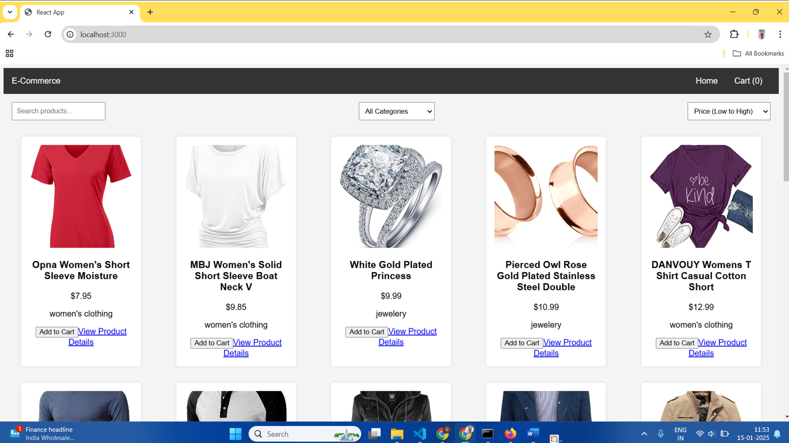
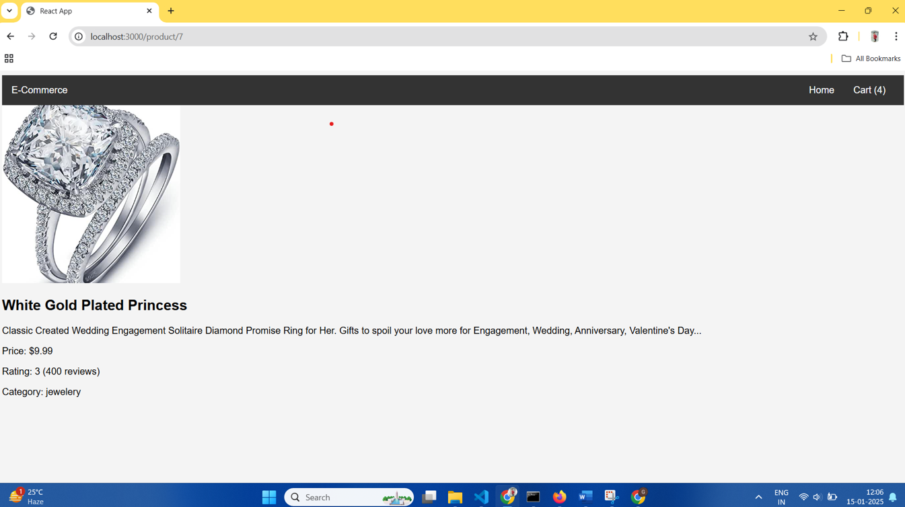
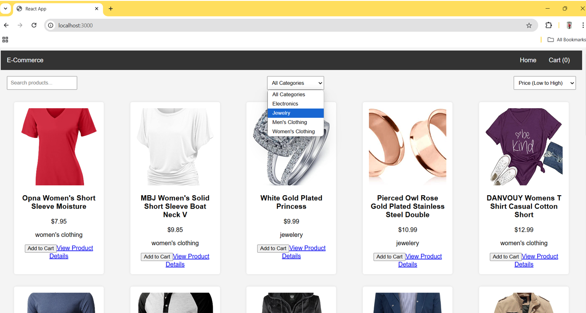
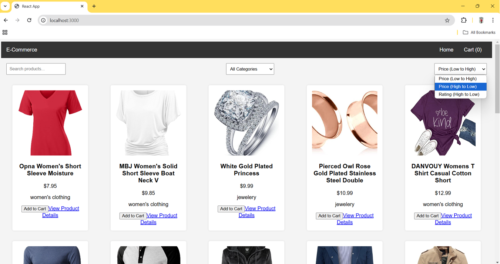
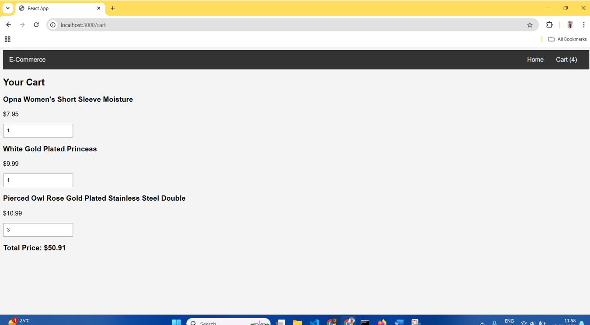

# E-Commerce Web App

A Basic E-Commerce Front-End Built with React.js. This app allows users to:
- View Products
- View Product Details
- Filter and Sort Them
- Add Products to The Cart

## Features
- Display Products Fetched from an API
- View Detailed Information for Each Product
- Filter Products by Name and Category
- Sort Products by Price
- Add Products to The Shopping Cart
- View Cart and Adjust Quantities

## Setup (How to Run the App Locally)
1. Clone the Repository:
   ```bash
   git clone https://github.com/gauravawate5712/E-commerce-web-app-final.git
   ```
2. Install Dependencies:
   ```bash
   npm install
   ```
3. Run the App:
   ```bash
   npm start
   ```

## Technologies Used
- ReactJS
- Axios for API calls
- React Router for navigation

## Assignment (E-Commerce) Screenshot:

### 1) Home Page: Display Products


### 2) View Detailed Information for Each Product


### 3) Filter Product by Name and Category


### 4) Sort Products by Price


### 5) View Cart and Adjust Quantities


### 6) Add Products to The Shopping Cart

